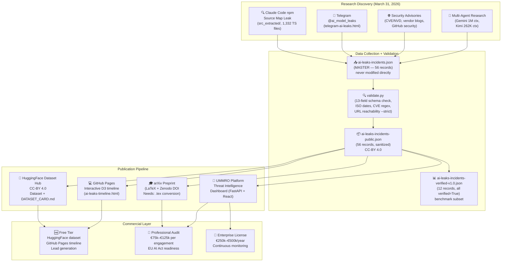
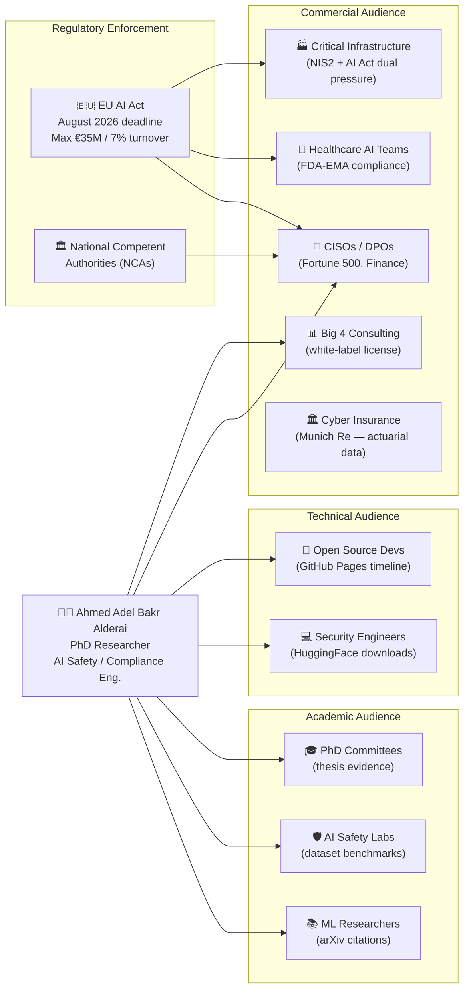

# High-Level Architecture: AI Security Incidents Research Project

**Author:** Ahmed Adel Bakr Alderai
**Date:** April 4, 2026

---

## 1. System Overview



---

## 2. Project Timeline

```mermaid
timeline
    title AI Security Incidents Research: Origin to Publication
    section March 31, 2026 — Project Start
        16:47    : src.zip downloaded (Claude Code npm source map)
                 : 1,332 TypeScript files extracted (src_extracted/)
        19:19    : AI_SECURITY_INCIDENTS_AUDIT_2026.md produced
                 : all-agent-outputs-combined.txt (1.6MB)
        23:43    : INVENTORY.md created on Hetzner
                 : Hetzner corpus: 2.0GB, 13,615 files
    section April 1, 2026 — Dataset + Publication Assets
        02:03    : ai-leaks-timeline.html (D3 interactive viz)
        03:38    : LICENSE, CITATION.cff, schema.json, README.md
        03:38    : DATASET_CARD.md, ARXIV_ABSTRACT.md created
        16:35    : BENCHMARK_TASK.md (EU AI Act classification task)
        19:54    : MASTER_STRATEGY.md finalized
    section April 4, 2026 — Expansion + Documentation Sprint
        00:00    : Dataset expanded: 40 → 56 incidents (16 added by Kimi thinking)
        01:47    : docs/ sprint begins (Gemini + Kimi parallel)
        01:57    : 8 docs complete (docs/00–09_*.md)
        02:56    : source-references/ on Hetzner (HTML evidence files)
        02:59    : All docs synced to Hetzner
```

---

## 3. Stakeholder Map



---

## 4. Output Tiers

| Tier | Format | Size | Audience | License |
|------|--------|------|----------|---------|
| JSON (master) | `ai-leaks-incidents.json` | 35KB, 56 records | Internal only | Proprietary |
| JSON (public) | `ai-leaks-incidents-public.json` | 35KB, 56 records | Everyone | CC-BY 4.0 |
| JSON (benchmark) | `ai-leaks-incidents-verified-v1.0.json` | 14KB, 12 records | Researchers | CC-BY 4.0 |
| CSV | `ai-leaks-incidents-public.csv` | 16KB | Data analysts | CC-BY 4.0 |
| HTML viz | `ai-leaks-timeline.html` | 32KB | Public | CC-BY 4.0 |
| UMMRO API | `/v1/threat-intelligence/*` | Live | Enterprise | Commercial |

---

## 5. Verification Pipeline

```
Source Discovery
    │
    ▼
URL collection → urls[] field in JSON
    │
    ▼
validate.py --strict (HEAD request to each URL)
    │
    ├── URL responds < 400 → verified: true → data_classification: "public_sources_only"
    ├── URL returns 404/blocked → verified: false → data_classification: "unverified"
    └── Internal/redacted data → verified: true → data_classification: "redacted_internal_data"
    │
    ▼
Benchmark subset: verified-v1.0.json (12 records, all verified=True)
```

**Current verification rate:** 12/56 = 21.4% verified

**Path to 80% verification:**
1. OSINT search for unverified incidents
2. Monitor Wiz/Oligo/Salt Security vendor blogs
3. Archive sources via Wayback Machine to prevent link rot

---

## 6. Key Metrics at a Glance

| Metric | Value |
|--------|-------|
| Total incidents | 56 |
| Verified | 12 (21.4%) |
| Critical severity | 20 (35.7%) |
| Still live (unpatched) | 9 (16.1%) |
| Claude Code TS source files | 1,332 files, 33MB |
| Hetzner corpus | 2.8GB, 15 categories, 13,615+ files |
| HuggingFace distillation downloads | 2.1M (flagship finding) |
| EU AI Act enforcement deadline | August 2026 |
| Max EU fine exposure | €35M or 7% global turnover |
| Commercial revenue potential | €75k–€500k per engagement |
