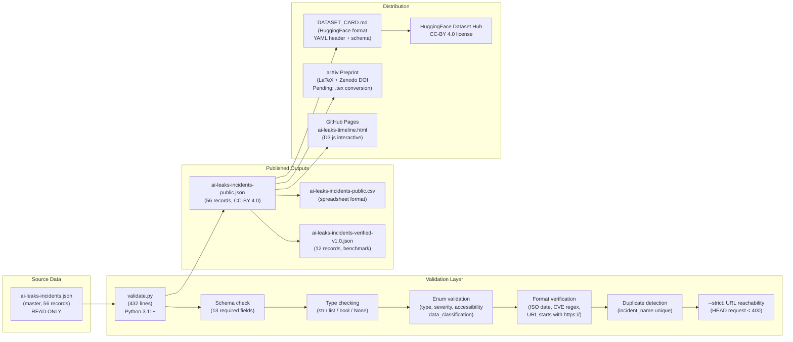

# Low-Level Architecture: Data Schema, Components & Validation

**Author:** Ahmed Adel Bakr Alderai
**Date:** April 4, 2026

---

## 1. Schema Deep-Dive (13 Fields)

### `ai-leaks-incidents-public.json` — Record Structure

```json
{
  "incident_name":     "string (required, unique)",
  "company":           "string (required)",
  "date":              "string | null (ISO 8601: YYYY-MM-DD)",
  "type":              "enum (required, 9 values)",
  "how":               "string (required, attack vector)",
  "what_exposed":      "string (required, data exposed)",
  "accessibility":     "enum (required, 6 values)",
  "severity":          "enum (required, 4 values)",
  "urls":              "array | null (list of https:// strings)",
  "cve":               "string | null (regex: ^CVE-\\d{4}-\\d+$)",
  "notes":             "string | null",
  "verified":          "boolean (required)",
  "date_missing":      "boolean (required)",
  "data_classification": "enum (required, 3 values)"
}
```

### Field Constraints Matrix

| Field | Type | Nullable | Enum Values |
|-------|------|----------|-------------|
| `incident_name` | string | no | — (unique key) |
| `company` | string | no | — |
| `date` | string | yes | ISO 8601 date only |
| `type` | string | no | supply_chain, source_code, user_data, api_keys, training_data, model_weights, state_sponsored_misuse, system_prompt, api_vulnerability |
| `how` | string | no | — (free text) |
| `what_exposed` | string | no | — (free text) |
| `accessibility` | string | no | live, patched, taken_down, contained, archived, unknown |
| `severity` | string | no | critical, high, medium, low |
| `urls` | array | yes | each element must start with http:// or https:// |
| `cve` | string | yes | must match `^CVE-\d{4}-\d+$` |
| `notes` | string | yes | — (free text) |
| `verified` | boolean | no | true / false |
| `date_missing` | boolean | no | true / false |
| `data_classification` | string | no | public_sources_only, redacted_internal_data, unverified |

---

## 2. Component Interaction Diagram



---

## 3. D3.js Visualization Architecture (`ai-leaks-timeline.html`)

```
ai-leaks-timeline.html (32KB, self-contained)
├── Inline CSS:  Bootstrap 5 + custom timeline styles
├── Inline JS:   D3.js v7 (CDN) + custom visualization code
└── Data binding:
    ┌─────────────────────────────────────────────────────────┐
    │  JSON structure read at runtime:                         │
    │  incidents[] → d3.rollup(by year) → timeline rows       │
    │                                                          │
    │  Scales:                                                │
    │  - d3.scaleTime() → X axis (Jan 2025 – Apr 2026)       │
    │  - d3.scaleBand() → Y axis (4 severity tiers)          │
    │  - Y jitter: random offset within severity band         │
    │    (prevents overlap of same-date incidents)            │
    │                                                          │
    │  For each incident:                                      │
    │  - date → X axis position (time scale)                  │
    │  - severity → circle color (critical=red, high=orange)  │
    │  - type → icon class (supply_chain=⛓️, source_code=📁) │
    │  - company + incident_name → tooltip on hover           │
    │                                                          │
    │  Filters (DOM dropdowns):                               │
    │  - type dropdown → d3.filter() on incident type        │
    │  - severity checkboxes → AND filter on severity field  │
    │  - company search → icontains on company name          │
    │  → All filters use d3 selection update pattern (join)  │
    └─────────────────────────────────────────────────────────┘
```

---

## 4. Incident Type Taxonomy Decision Tree

```
Security Event Detected
        │
        ▼
Is the primary target source code / IP?
├─ YES → Was it from a package manager (npm, pip)?
│        ├─ YES (and malicious package) → supply_chain
│        ├─ YES (and exposed source map / repo leak) → source_code
│        └─ NO (API output harvesting for model training) → model_weights
│
├─ Was user PII or conversation data exposed?
│  └─ YES → user_data
│
├─ Was training data poisoned or extracted?
│  └─ YES → training_data
│
├─ Were API keys or credentials exposed?
│  └─ YES → api_keys
│
├─ Was the API itself vulnerable (SSRF, injection, BOLA)?
│  └─ YES → api_vulnerability
│
├─ Was the system prompt extracted / jailbroken?
│  └─ YES → system_prompt
│
└─ Was it nation-state misuse of AI tools?
   └─ YES → state_sponsored_misuse
```

---

## 5. Severity Classification Logic

```
CRITICAL: One or more of:
  - accessibility == "live" AND severity_impact == high
  - Mass user data exposed (>100k records)
  - Supply chain compromise with widespread propagation
  - RCE (Remote Code Execution) vulnerability

HIGH: One or more of:
  - accessibility == "patched" but was exploited
  - Significant IP theft (source code, model weights)
  - API key exposure with admin/write access

MEDIUM: One or more of:
  - accessibility == "taken_down" / "contained" quickly
  - Limited blast radius
  - Theoretical vulnerability, no confirmed exploitation

LOW: All of:
  - Minimal impact, academic/proof-of-concept only
  - Rapidly contained
  - No confirmed data exfiltration
```

---

## 6. Benchmark Task: EU AI Act Article Classification

**Task definition** (`BENCHMARK_TASK.md`):
```
Input:  incident_name + company + type + how + what_exposed
Output: EU AI Act article violated (Article 9 / Article 13 / Article 15)

Ground truth (12 verified incidents):
  Article 9  (Risk Management):
    - supply_chain incidents
    - state_sponsored_misuse
  Article 13 (Transparency):
    - system_prompt incidents
    - source_code leaks
  Article 15 (Accuracy/Robustness/Cybersecurity):
    - model_weights, api_keys, api_vulnerability
    - training_data incidents
  Article 5  (User Data):
    - user_data incidents

Baseline: Random classifier = 33.3% accuracy (3 primary articles)
Target:   Fine-tuned LLM  = 85%+ accuracy
```

---

## 7. validate.py — Validation Rules Summary

From `validate.py` (432 lines, Python 3.11+):

```python
REQUIRED_FIELDS = [
    "incident_name", "company", "type", "how", "what_exposed",
    "accessibility", "severity", "verified", "date_missing", "data_classification"
]

ENUM_FIELDS = {
    "type": {
        "supply_chain", "source_code", "user_data", "api_keys", "training_data",
        "model_weights", "state_sponsored_misuse", "system_prompt", "api_vulnerability"
    },
    "accessibility": {"live", "patched", "taken_down", "contained", "archived", "unknown"},
    "severity": {"critical", "high", "medium", "low"},
    "data_classification": {"public_sources_only", "redacted_internal_data", "unverified"}
}

FORMAT_CHECKS = {
    "date":  r"^\d{4}-\d{2}-\d{2}$"  (ISO 8601 + calendar validity),
    "cve":   r"^CVE-\d{4}-\d+$",
    "urls":  each item must start with "http://" or "https://"
}

# --strict flag: HEAD request to each URL, status < 400 required
```

**Current validation results:** 56/56 records pass all checks.

---

## 8. File Dependency Graph (Complete)

```
ai-leaks-incidents.json (MASTER)
├── validate.py → validates → ai-leaks-incidents-public.json
├── ai-leaks-incidents-public.csv (generated from public.json)
├── ai-leaks-incidents-verified-v1.0.json (12 verified subset)
│
├── ai-leaks-timeline.html (reads public.json at runtime via fetch())
├── DATASET_CARD.md (references public.json + verified-v1.0.json)
├── schema.json (JSON Schema for IDE validation)
├── CITATION.cff (GitHub citation format: APA + BibTeX)
│
├── UMMRO Integration:
│   ├── migrations/068_create_security_incidents_table.py (PostgreSQL)
│   ├── src/models/security_incident.py (SQLAlchemy ORM)
│   ├── src/app/schemas/incident_schemas.py (Pydantic v2 DTOs)
│   ├── src/api/services/incident_service.py (business logic)
│   ├── src/api/routers/threat_intelligence.py (FastAPI: 4 endpoints)
│   └── src/compliance/incident_catalog.py (EU AI Act mapping)
│
└── Academic Pipeline:
    ├── ARXIV_ABSTRACT.md → arXiv_draft.md → (pending .tex conversion)
    └── Zenodo DOI (pending upload)
```
