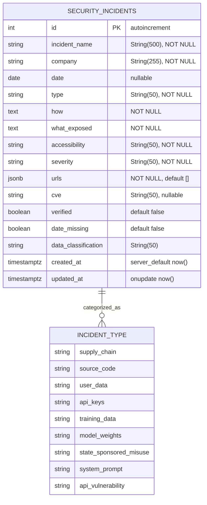

# UMMRO Threat Intelligence Module: Integration Documentation

**Author:** Ahmed Adel Bakr Alderai
**Date:** April 4, 2026
**Module:** Track B — UMMRO Platform Integration (Issue #1565, Phase 4-05)

---

## 1. Architecture Overview

The Threat Intelligence module adds 8 new files to UMMRO's existing 91-module codebase without
modifying any existing code. All additions are purely additive.

```
ai-leaks-incidents-public.json (56 records)
        │
        ▼
migrations/068_create_security_incidents_table.py   ← PostgreSQL schema + GIN indexes
        │
        ▼
src/models/security_incident.py                     ← SQLAlchemy ORM (SecurityIncident)
        │
        ├──────────────────────────────────────────►  src/app/schemas/incident_schemas.py
        │                                              (Pydantic v2 DTOs)
        ▼
src/api/services/incident_service.py                ← Business logic (async SQL)
        │
        ▼
src/api/routers/threat_intelligence.py              ← FastAPI router (4 endpoints)
        │
        ├── src/api/routers/__init__.py              ← _explicit_routers registration
        └── src/server.py                            ← try/except fallback registration

src/compliance/incident_catalog.py                  ← EU AI Act article mapper
        └── Imports from eu_ai_act_article15.py      ← Existing compliance engine

frontend/src/app/[locale]/(dashboard)/incident-catalog/page.tsx   ← React dashboard
training/exercises/m30_real_world_incidents/__init__.py            ← CART exercises 311-320
```

---

## 2. Data Flow

```
JSON File (56 incidents)
    → migration 068: CREATE TABLE security_incidents (JSONB, GIN indexes)
    → seed_security_incidents.py: ON CONFLICT DO NOTHING bulk insert
    → PostgreSQL table: security_incidents

API Request (authenticated user)
    → GET /v1/threat-intelligence/incidents?severity=critical&page=1
    → threat_intelligence.py router (rate: 20/min)
    → IncidentService.list_incidents(filters, page=1, limit=20)
    → SQLAlchemy async query with WHERE clauses + LIMIT/OFFSET
    → IncidentListResponse(items=[SecurityIncidentResponse...], total=N, page=1, limit=20)

EU AI Act Compliance Flow
    → incident_catalog.py loaded (lazy, thread-safe)
    → get_incidents_for_article("article_15")  → 42 incidents
    → get_compliance_evidence("article_15", "ummro-v2")
    → generate_incident_mapping("ummro-v2") → JSON string
    → register_with_compliance_manager(manager)  → injects into EU AI Act documentation pipeline
```

---

## 3. API Surface

**Base prefix:** `/v1/threat-intelligence`
**Auth:** `get_current_user` (JWT required for all endpoints)
**Rate limiter:** uses `limiter` from `src/api/training.py`

| Method | Path | Rate | Response Schema | Description |
|--------|------|------|----------------|-------------|
| GET | `/incidents` | 20/min | `IncidentListResponse` | Paginated list with filters |
| GET | `/incidents/{incident_id}` | 10/min | `SecurityIncidentResponse` | Single incident detail |
| GET | `/stats` | 10/min | `IncidentStats` | Aggregated statistics |
| GET | `/timeline` | 10/min | `list[IncidentTimelineEntry]` | Date-ordered for D3 viz |

### Query Parameters (`GET /incidents`)
```
company:        str (max 255) — partial match on company name
type:           IncidentType enum — one of 9 incident categories
severity:       SeverityLevel enum — critical | high | medium | low
accessibility:  str (max 100) — live | patched | taken_down | contained | archived | unknown
verified:       bool — filter by human-verified status
date_from:      date — ISO 8601 lower bound
date_to:        date — ISO 8601 upper bound
page:           int (≥1, default=1)
limit:          int (1–100, default=20)
```

---

## 4. Pydantic v2 Schemas (`src/app/schemas/incident_schemas.py`)

### Type Aliases (Literal unions)
```python
IncidentType = Literal[
    "supply_chain", "source_code", "user_data", "api_keys",
    "training_data", "model_weights", "state_sponsored_misuse",
    "system_prompt", "api_vulnerability",
]
AccessibilityStatus = Literal["live", "patched", "taken_down", "contained", "archived", "unknown"]
SeverityLevel       = Literal["critical", "high", "medium", "low"]
DataClassification  = Literal["public_sources_only", "redacted_internal_data", "unverified"]
```

### `SecurityIncidentResponse` (returned by API)
```
id:                  int
incident_name:       str
company:             str
date:                Optional[date]
type:                IncidentType
how:                 str  (attack vector)
what_exposed:        str  (data exposed)
accessibility:       AccessibilityStatus
severity:            SeverityLevel
urls:                List[str]
cve:                 Optional[str]
verified:            bool
date_missing:        bool
data_classification: DataClassification
created_at:          datetime
updated_at:          datetime
description:         str  (@computed_field → alias for what_exposed)
notes:               str  (@computed_field → alias for how)
```

### `IncidentStats` (returned by `/stats`)
```
by_severity:     Dict[str, int]   — counts per severity level
by_type:         Dict[str, int]   — counts per incident type
by_accessibility: Dict[str, int]  — counts per accessibility status
total:           int               — total incidents
verified_count:  int               — verified=True count
live_count:      int               — accessibility="live" count
critical_count:  int               — convenience: critical severity
high_count:      int               — convenience: high severity
medium_count:    int               — convenience: medium severity
low_count:       int               — convenience: low severity
```

### `IncidentListResponse`
```
items:  List[SecurityIncidentResponse]
total:  int
page:   int
limit:  int
```

### `IncidentTimelineEntry` (lightweight, for D3 visualization)
```
date:          Optional[str]   — ISO 8601 date or null
incident_name: str
severity:      str
company:       str
```

---

## 5. SQLAlchemy Model (`src/models/security_incident.py`)

```python
class SecurityIncident(Base):
    __tablename__ = "security_incidents"

    id                 = Column(Integer,  PK, autoincrement)
    incident_name      = Column(String(500), nullable=False, index=True)
    company            = Column(String(255), nullable=False, index=True)
    date               = Column(Date, nullable=True, index=True)
    type               = Column(String(50),  nullable=False, index=True)
    how                = Column(Text, nullable=False)
    what_exposed       = Column(Text, nullable=False)
    accessibility      = Column(String(50),  nullable=False, index=True)
    severity           = Column(String(50),  nullable=False, index=True)
    urls               = Column(JSONB, nullable=False, default=list)
    cve                = Column(String(50),  nullable=True, index=True)
    verified           = Column(Boolean, nullable=False, default=False, index=True)
    date_missing       = Column(Boolean, nullable=False, default=False)
    data_classification = Column(String(50), nullable=False, default="unverified")
    created_at         = Column(DateTime(timezone=True), server_default=func.now())
    updated_at         = Column(DateTime(timezone=True), server_default=func.now(), onupdate=func.now())
```

### Entity Relationship Diagram


---

## 6. EU AI Act Compliance Mapping (`src/compliance/incident_catalog.py`)

### Article-Type Mapping
```python
INCIDENT_ARTICLE_MAPPING = {
    "supply_chain":          ["article_9", "article_15"],   # 6 incidents
    "training_data":         ["article_15", "article_9"],   # 9 incidents
    "system_prompt":         ["article_13"],                 # 3 incidents
    "model_weights":         ["article_15"],                 # 4 incidents
    "api_keys":              ["article_15"],                 # 5 incidents
    "api_vulnerability":     ["article_15"],                 # 5 incidents
    "state_sponsored_misuse":["article_9", "article_15"],   # 2 incidents
    "source_code":           ["article_13", "article_15"],  # 16 incidents
    "user_data":             ["article_5", "article_14"],   # 8 incidents
}
```

### Severity → Risk Level
```
critical / high → RiskLevel.HIGH
medium          → RiskLevel.LIMITED
low             → RiskLevel.MINIMAL
```

### Key Functions
| Function | Purpose |
|----------|---------|
| `get_incidents_for_article(article)` | Returns all incidents mapped to an EU AI Act article |
| `get_compliance_evidence(article, system_id)` | Generates structured evidence JSON for audit |
| `generate_incident_mapping(system_id)` | Full JSON document: all articles + all incidents |
| `register_with_compliance_manager(manager)` | Hooks into `eu_ai_act_article15.EUAIActCompliance` |
| `get_incident_statistics()` | Stats by type/severity/company/verification |
| `get_critical_incidents()` | Filter severity=="critical" |
| `get_verified_incidents()` | Filter verified==True |

### Integration Hook
```python
# In eu_ai_act_article15.py compliance pipeline:
from src.compliance.incident_catalog import register_with_compliance_manager

manager = EUAIActCompliance(...)
register_with_compliance_manager(manager)
# → manager.register_documentation_generator("threat_intel_mapping", generate_incident_mapping)
# → All Article 13/15 documentation outputs now include real-incident evidence
```

---

## 7. Migration 068 (`migrations/068_create_security_incidents_table.py`)

Key design decisions:
- **JSONB** for `urls` column (supports GIN indexing, faster queries than JSON)
- **GIN index** on `company` column (enables trigram full-text search)
- **Partial index** on `verified` WHERE verified=True (smaller index, faster compliance queries)
- **Composite index** on `(type, severity)` (common filter combination)
- Idempotent: uses `IF NOT EXISTS` / `ON CONFLICT DO NOTHING` pattern

---

## 8. Router Registration

### In `src/api/routers/__init__.py` (explicit list)
```python
_explicit_routers = [
    ...
    "threat_intelligence",  # GET /v1/threat-intelligence/*
]
```

### In `src/server.py` (try/except fallback for production reliability)
```python
try:
    from api.routers.threat_intelligence import router as threat_intel_router
    app.include_router(threat_intel_router)
except ImportError as e:
    logger.error(f"Failed to load threat_intelligence router: {e}")
    raise  # fail fast — do not silently disable threat intel endpoints
```

---

## 9. Docker Configuration

For production deployment, the JSON data file must be mounted into the container:

```yaml
# docker-compose.yml (ummro-api service)
services:
  ummro-api:
    environment:
      AI_LEAKS_INCIDENTS_PATH: /data/ai-leaks-incidents-public.json
    volumes:
      - /path/to/ai-leaks-incidents-public.json:/data/ai-leaks-incidents-public.json:ro
```

Without the volume mount, `incident_catalog.py` silently returns `[]` (empty list).

---

## 10. CART Training Module M30 (`training/exercises/m30_real_world_incidents/`)

- **Module number:** M30 (follows M29: Incident Response)
- **Exercise IDs:** cart-m30-301 through cart-m30-310 (10 exercises)
- **Case studies:** TeamPCP cascading supply chain, Shai-Hulud npm worm, Claude Code source map leak
- **Learning objectives:** Analyze real AI security incidents, identify EU AI Act article violations, draft incident response plans

---

## 11. Frontend Dashboard (`frontend/src/app/[locale]/(dashboard)/incident-catalog/page.tsx`)

Key UI components:
- Stats cards: Total incidents / Critical count / High count / Still Live count
- Filterable table: company, type, severity, accessibility dropdowns
- Incident drawer: full detail view with URLs, CVE, EU AI Act article
- i18n: `messages/en.json` and `messages/ar.json` both have `incidentCatalog` namespace (15 keys)

**Navigation:** Registered in `frontend/src/components/navigation/Sidebar.tsx` under the Security group (lines 132–213).
