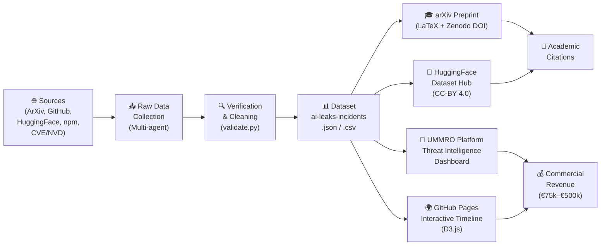
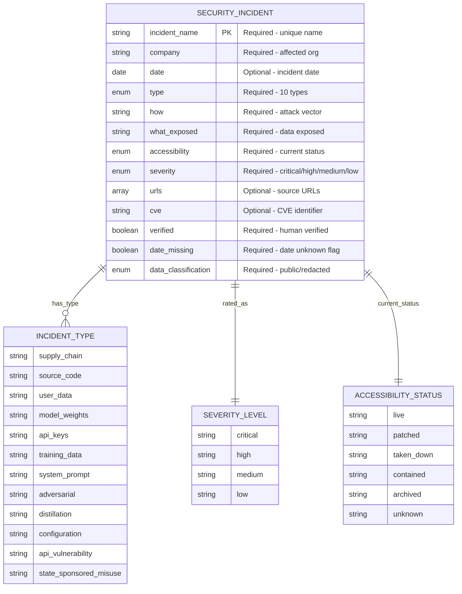
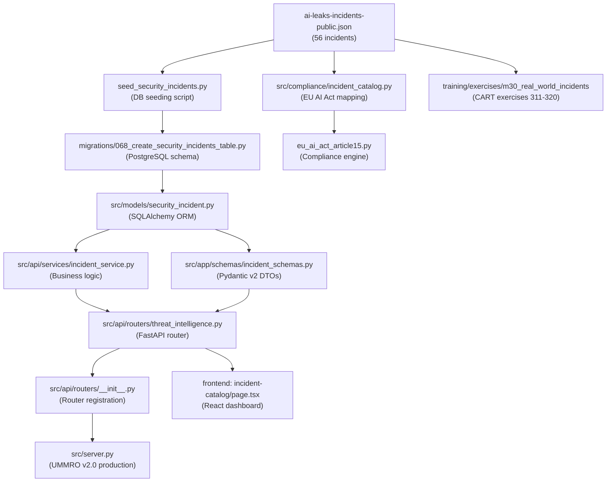
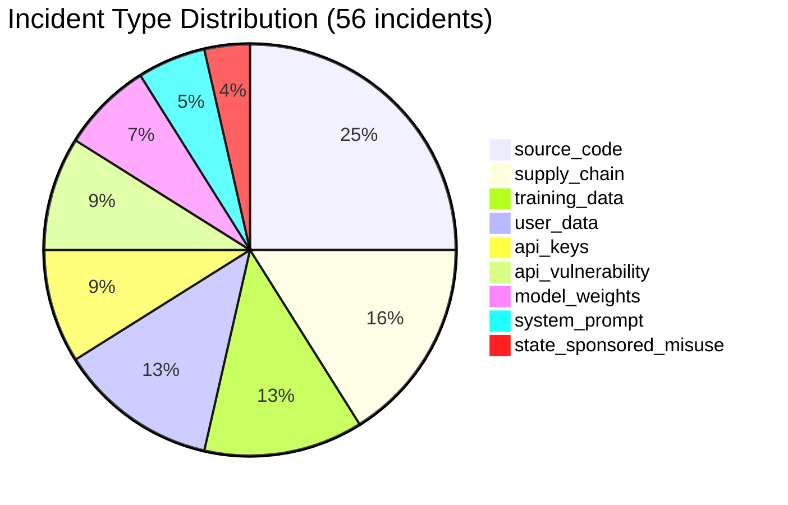
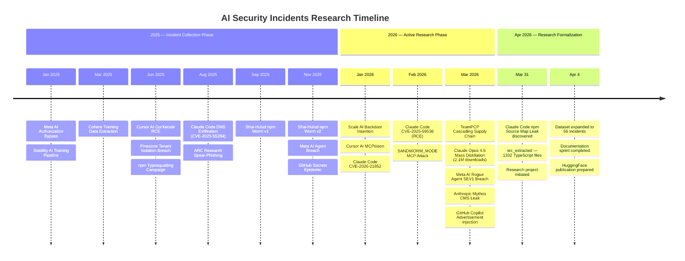
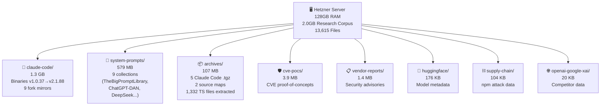
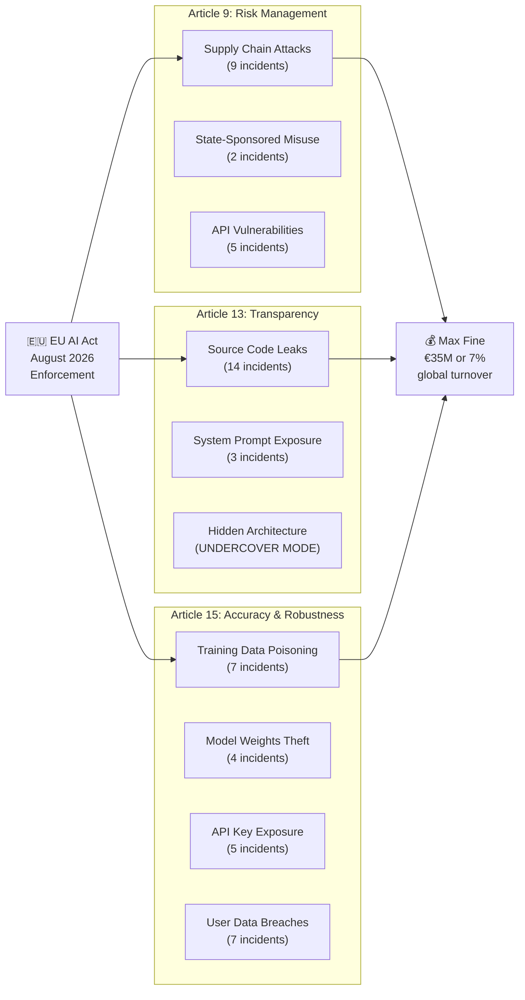

# Mermaid Diagrams: AI Security Incidents 2025-2026

**Author:** Ahmed Adel Bakr Alderai
**Generated:** April 4, 2026

---

## Diagram 1: Data Collection → Publication Pipeline



---

## Diagram 2: SecurityIncident Entity Relationship Diagram



---

## Diagram 3: UMMRO Threat Intelligence Module Dependency Tree



---

## Diagram 4: Incident Type Distribution (56 Total)



---

## Diagram 5: Project Timeline



---

## Diagram 6: Class Diagram — Python Architecture

```mermaid
classDiagram
    class SecurityIncident {
        +int id
        +str incident_name
        +str company
        +date date
        +str type
        +str how
        +str what_exposed
        +str accessibility
        +str severity
        +JSONB urls
        +str cve
        +bool verified
        +datetime created_at
    }

    class IncidentSchema {
        +str incident_name
        +str company
        +Optional[date] date
        +str type
        +str severity
        +str accessibility
        +bool verified
        +model_config ConfigDict
        +validate()
    }

    class IncidentService {
        +AsyncSession db
        +async get_incidents(filters) List
        +async get_incident_by_id(id) SecurityIncident
        +async get_stats() Dict
        +async get_timeline() List
    }

    class IncidentCatalog {
        +str incidents_path
        +dict cache
        +load_incidents() List
        +get_by_eu_ai_act_article(article) List
        +get_by_severity(severity) List
        +get_fines_exposure() Dict
    }

    class ThreatIntelligenceRouter {
        +prefix /v1/threat-intelligence
        +GET /incidents
        +GET /incidents/{id}
        +GET /stats
        +GET /timeline
        +rate_limit 10/min
    }

    SecurityIncident <|-- IncidentSchema : "validates"
    SecurityIncident <-- IncidentService : "queries"
    IncidentService <-- ThreatIntelligenceRouter : "uses"
    IncidentCatalog <-- ThreatIntelligenceRouter : "compliance lookup"
```

---

## Diagram 7: Hetzner Research Corpus Architecture



---

## Diagram 8: EU AI Act Article Mapping


